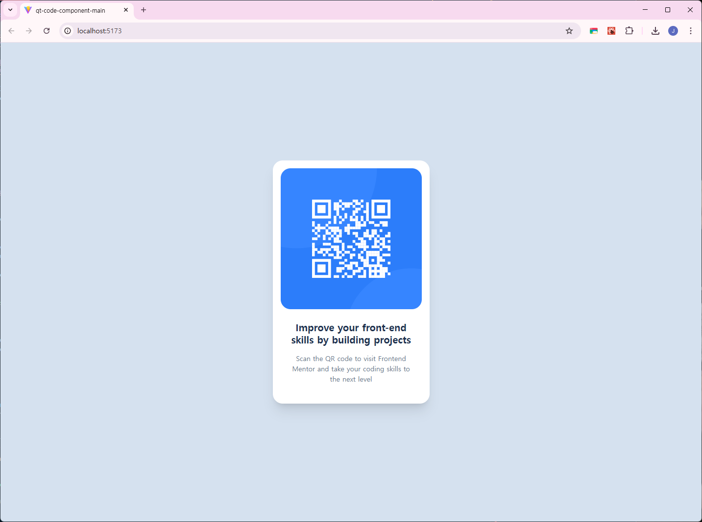

# Frontend Mentor - QR code component solution

This is a solution to the [QR code component challenge on Frontend Mentor](https://www.frontendmentor.io/challenges/qr-code-component-iux_sIO_H). Frontend Mentor challenges help you improve your coding skills by building realistic projects. 

## Table of contents

- [Overview](#overview)
  - [Screenshot](#screenshot)
  - [Links](#links)
- [My process](#my-process)
  - [Built with](#built-with)
  - [What I learned](#what-i-learned)

## Overview

### Screenshot

### Links

- Solution URL: [Github](https://github.com/umnoni/qr-code-component-main)
- Live Site URL: [Vercel](https://qr-code-component-main-one-liart-13.vercel.app/)

## My process

### Built with

- [React](https://reactjs.org/) - JS library
- [Tailwind CSS](https://tailwindcss.com/)

### What I learned
- **Centering elements** using Flexbox (`flex`, `items-center`, `justify-center`).
- **Tailwind Spacing System**: Understanding that `1 unit = 4px`.
- **Preflight and Reset**: How Tailwind handles default browser styles.
- **Arbitrary Values**: Using `[]` for specific values like `text-[22px]` or `bg-[#D5E1EF]`.

Actually, this is my first Tailwind CSS project. Everything in this code is a new lesson for me!😂
